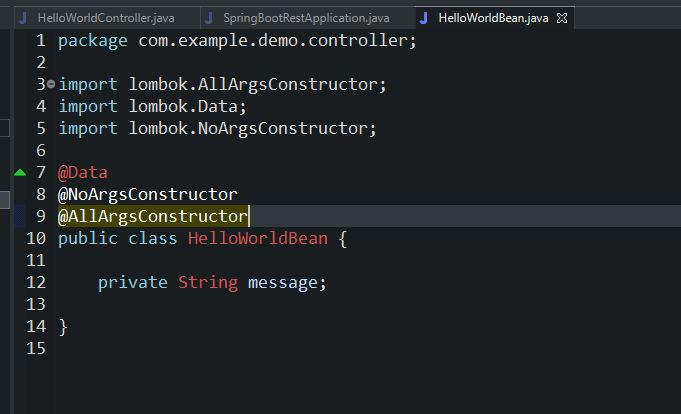
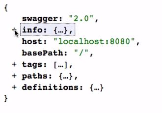
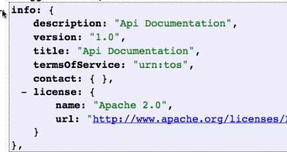
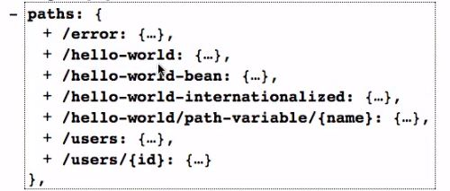
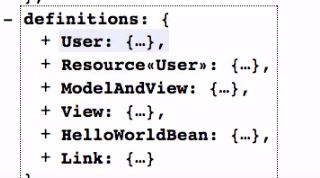

# Book 1 : Master java webservices and restful api with spring boot
## 1. initializing restful webservices with spring boot
import features from spring starter


the project structure will look like this<br>


## 2. understanding the restful services we will create

```
create a user : POST /users
delete a user: DELETE /users/{1}
get all user : GET /users
get a user by id : GET /users/{1}

retrieve all posts for a user : GET /users/{id}/posts
create posts for a user : POST /users/{id}/posts
retrieve details of a post : GET /users/{id}/posts/{post_id}

```

## 3. creating a hello world services


now in the local host


## 4. enhancing the hello world services to return a bean/object





## 5. enhancing the hello world service with a path variable


## 6. creating user bean and user services

here we are creating a User bean . <br>
The user bean will have the following
```java
import lombok.AllArgsConstructor;
import lombok.Data;
import lombok.Getter;
import lombok.NoArgsConstructor;
import lombok.Setter;

@Data
@Getter
@Setter
@AllArgsConstructor
@NoArgsConstructor
public class User {
	private Integer id;
	private String name;

}

```
now we will create the **UserService** *interface* and annotate with **@Service** <br>
```java
package com.example.demo.user;

import java.util.List;

import org.springframework.stereotype.Service;

@Service
public interface UserService {

	// get list of all users
	List<User> getAllUsers();

	/*
	 * save the new user to the list and get the list of all users (it should
	 * include the new user too)
	 */
	List<User> saveuser(User user);

	// get user based on id search
	User findUserById(Integer id);

}


```
then we can create the Service implemantation class and make it implement the UserService interface .

```java

package com.example.demo.user;

import java.util.ArrayList;
import java.util.List;

import org.springframework.stereotype.Repository;

@Repository
public class UserServiceImpl implements UserService {

	private static List<User> users = new ArrayList<>();

	static {
		users.add(new User(1, "Deadpool"));
		users.add(new User(2, "Wolverine"));
	}

	@Override
	public List<User> getAllUsers() {
		return users;
	}

	@Override
	public List<User> saveuser(User user) {
		// TODO Auto-generated method stub
		return null;
	}

	@Override
	public User findUserById(Integer id) {
		// TODO Auto-generated method stub
		return null;
	}

}

```

now we will create the Controller class and add field injection to the UserService like 
> :red_circle: **@Autowired <br>
                 private UserService**

```java
package com.example.demo.user;

import java.util.List;

import org.springframework.beans.factory.annotation.Autowired;
import org.springframework.web.bind.annotation.GetMapping;
import org.springframework.web.bind.annotation.RequestMapping;
import org.springframework.web.bind.annotation.RestController;

@RestController
@RequestMapping("/test")
public class UserController {

	@Autowired
	private UserService userService;

	@GetMapping("/users")
	public List<User> getAllUsers() {
		return userService.getAllUsers();
	}
	
	

}

```

now as you can see in the above controller the Request mapping has the path as "test" and the @GetMapping has the path as "/users" so the uri will become **"http://localhost:8080/test/users"** now run this in postman


## 7. calling with the path variable

in this example we will try to get a user with a specific user id <br>
we already have the abstract method defined in the Service class **"User findUserById(Integer id);"** we just need to add body for it in the implementation class . <br>

> :red_circle: **@PathVariable** to be added to the method .

```java
//inside UserServiceImpl class
@Override
	public User findUserById(Integer id) {
		return users.stream().filter(i-> i.getId()==id).findFirst().get();
	}
// inside UserController class

@GetMapping("/users/{id}")
	public User getUserById(@PathVariable("id") Integer id) {
		return userService.findUserById(id);
	}

```


## 8. implementing the post method
Always remember, a successful post message should give you **201 : created** status message .<br>
but for now lets do the 200 way and in the next slide we will check the response entity and make it to 201

1. the service implementation class 
```java
@Override
	public List<User> saveuser(User user) {
		users.add(user);
		return users;
	}

```

2. the controller class
```java
@PostMapping("/users")
	public List<User> saveUser(@RequestBody User user) {
		return userService.saveuser(user);
	}
```

3. postman
>make sure to send the body as mentioned below
```
{
    "id": 3,
    "name": "Shazam"
}
```


## 9. Enhancing post method to return 201 and the uri location

to get 201 we need to return responseEntity on the return type of the post method instead of the list <br>

```java
URI uri = ServletUriComponentsBuilder
				.fromCurrentRequest()
				.path("/{id}")
				.buildAndExpand(user.getId())
				.toUri();
```

and the response entity should look like this

```java
 ResponseEntity.status(HttpStatus.CREATED)
				.header("user header", uri.toString())
				.body(userService.saveuser(user));
```
so the method will be as follows

```java
@PostMapping("/users")
public ResponseEntity<List<User>>saveUser(@RequestBody User user) {
		URI uri = ServletUriComponentsBuilder
				.fromCurrentRequest()
				.path("/{id}")
				.buildAndExpand(user.getId())
				.toUri();
		
		return ResponseEntity.status(HttpStatus.CREATED)
				.header("user header", uri.toString())
				.body(userService.saveuser(user));
	}
```
now if we will check the postman 

and the header will look like this


## 10. Implementing exception handling

its always good to write your custom error message.
> :red_circle: **@ControllerAdvice** has to be added to the custom exception class.
lets go through the get user id service and see

```java
\\inside UserServiceImpl class
@Override
	public User findUserById(Integer id) {
		Optional<User> userOpt = users.stream().filter(i -> i.getId() == id).findFirst();
		
		return userOpt.isPresent() ? userOpt.get():null;
	}

\\ create UserNotFound class
public class UserNotFoundException extends RuntimeException {

	/**
	 * 
	 */
	private static final long serialVersionUID = -4553824199994173031L;

	private String message;

	public UserNotFoundException(String message) {
		super(message);
		this.message = message;
	}

	public String getMessage() {
		return message;
	}

	public void setMessage(String message) {
		this.message = message;
	}

}

\\ create the controller advice class and name it as ExceptionHelper class
package com.example.demo.user;

import org.slf4j.Logger;
import org.slf4j.LoggerFactory;
import org.springframework.http.HttpStatus;
import org.springframework.http.ResponseEntity;
import org.springframework.web.bind.annotation.ControllerAdvice;
import org.springframework.web.bind.annotation.ExceptionHandler;
import org.springframework.web.servlet.mvc.method.annotation.ResponseEntityExceptionHandler;

@ControllerAdvice
public class ExceptionHelper extends ResponseEntityExceptionHandler {
	private static final Logger logger = LoggerFactory.getLogger(ExceptionHelper.class);

	@ExceptionHandler(UserNotFoundException.class)
	public ResponseEntity<Object> userNotFoundException(UserNotFoundException unfe) {
		logger.error("USER NOT FOUND: " +unfe.getMessage());
		return new ResponseEntity<Object>(unfe.getMessage(), HttpStatus.NOT_FOUND);
	}

}


\\now in the controller 

	@GetMapping("/users/{id}")
	public ResponseEntity<User> getUserById(@PathVariable("id") Integer id) {
		User user = userService.findUserById(id);
		if(user == null) {
			throw new UserNotFoundException("user with id "+id+" does not exist .");
		}
		return ResponseEntity.status(HttpStatus.OK).body(user);
	}
 // check this in postman
 http://localhost:8080/test/users/9
 
 this will give you 404 not found with a valid message and in the log 
 you will see below message
 
 ERROR 23336 --- [nio-8080-exec-1] com.example.demo.user.ExceptionHelper    : USER NOT FOUND: user with id 9 does not exist .


```
## 11. Implementing swagger documentation 

there are few tags that we need to have idea on .



1. **Info Tag**: this will give you the highlevel view about the API



2. **tags**: tags are used to group resources in to multiple catagories

3. **path**: includes the details of all the resources we are exposing .



4. **definations**: these are basically the objects .



:ledger: lets create basic swagger documentation

1. create a new class and name it as SwaggerConfig
2. add @Configuration and @EnableSwagger2 to it .

```java
<dependency>
			<groupId>io.springfox</groupId>
			<artifactId>springfox-boot-starter</artifactId>
			<version>3.0.0</version>
		</dependency>
==============================================================
package com.example.demo;

import org.springframework.context.annotation.Bean;
import org.springframework.context.annotation.Configuration;

import springfox.documentation.spi.DocumentationType;
import springfox.documentation.spring.web.plugins.Docket;
import springfox.documentation.swagger2.annotations.EnableSwagger2;

@Configuration
@EnableSwagger2
public class SwaggerConfig {
	@Bean
	public Docket postsApi() {
		return new Docket(DocumentationType.SWAGGER_2);
	}

}

//for api doc
http://localhost:8080/v2/api-docs

//for swagger ui
http://localhost:8080/swagger-ui/index.html#/

```

## 12 . Implementing static filtering with RESTFUL services

lets say there is one field which we do not really want to show in the response ; then in that case we can use the static filtering .

basically use **@JsonIgnore** on the field .

```java
@Data
@Getter
@Setter
@AllArgsConstructor
@NoArgsConstructor
public class User {
	private Integer id;
	private String name;
	@JsonIgnore
	private int age;

}

```

lets say there are too many fields that we want to ignore ; in that case we can use the **JsonIgnoreProperties** annotation in the class level with the field names .


basically use "JsonIgnoreProperties" for static filtering .


```java
@Data
@Getter
@Setter
@AllArgsConstructor
@NoArgsConstructor
@JsonIgnoreProperties(value = { "age", "salary", "password" })
public class User {
	private Integer id;
	private String name;
	private int age;
	private double salary;
	private String password;

}

```
## 13 . Implementing dynamic filtering with RESTFUL services

if we want to disable one field based on the result of a condition then we can use dynamic filtering .

```java
package com.example.demo.user;

import com.fasterxml.jackson.annotation.JsonFilter;

import lombok.AllArgsConstructor;
import lombok.Data;
import lombok.Getter;
import lombok.NoArgsConstructor;
import lombok.Setter;

@Data
@Getter
@Setter
@AllArgsConstructor
@NoArgsConstructor
@JsonFilter("userFil")
public class User {
	private Integer id;
	private String name;
	private int age;
	private double salary;
	private String password;

}

//////////////////////////////////////////////////////////

@GetMapping("/users/{id}")
	public ResponseEntity<MappingJacksonValue> getUserById(@PathVariable("id") Integer id) {
		User user = userService.findUserById(id);
		if (user == null) {
			throw new UserNotFoundException("user with id " + id + " does not exist .");
		}
		SimpleBeanPropertyFilter userBeanFilter = SimpleBeanPropertyFilter.filterOutAllExcept("salary","password");
		FilterProvider userFilter = new SimpleFilterProvider().addFilter("userFil", userBeanFilter);
		MappingJacksonValue mapping = new MappingJacksonValue(user);
		mapping.setFilters(userFilter);
		return ResponseEntity.status(HttpStatus.OK).body(mapping);
	}
	
```


