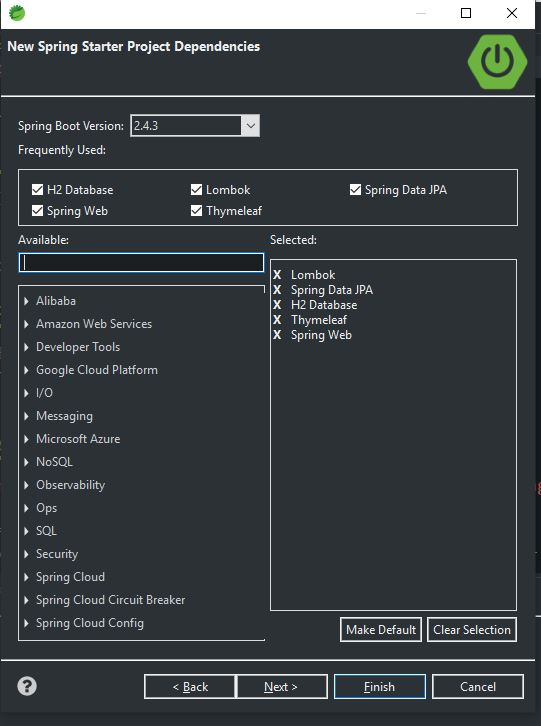
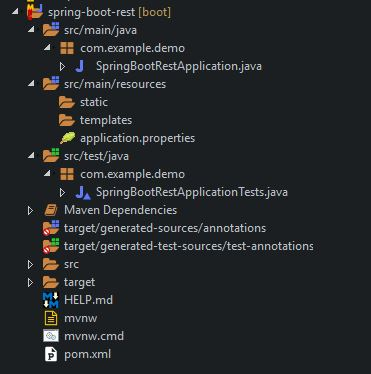

# Book 1 : Master java webservices and restful api with spring boot
## 1. initializing restful webservices with spring boot
import features from spring starter



the project structure will look like this<br>



## 2. understanding the restful services we will create

```
create a user : POST /users
delete a user: DELETE /users/1
get all user : GET /users
get a user by id : GET /users/1

```


